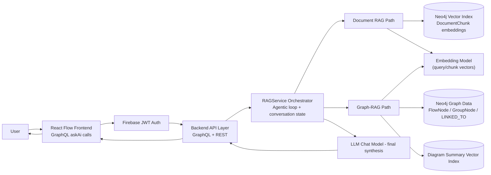
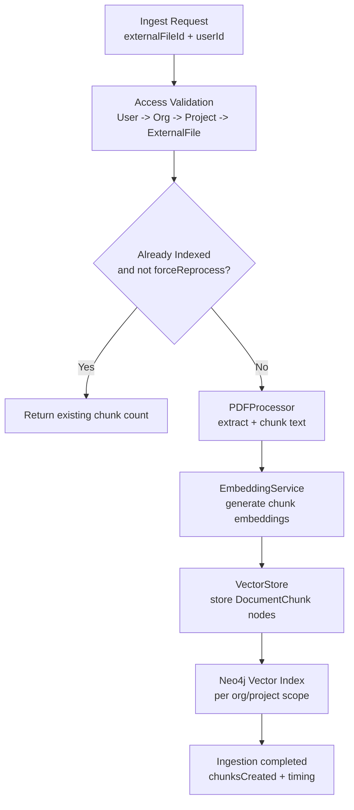
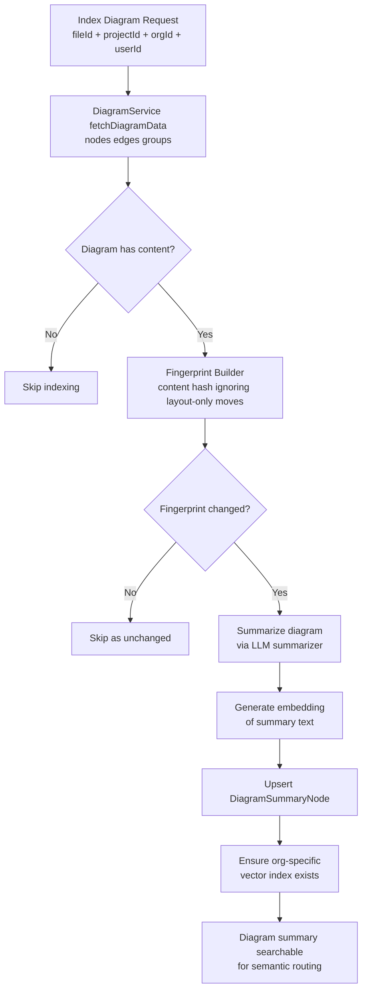
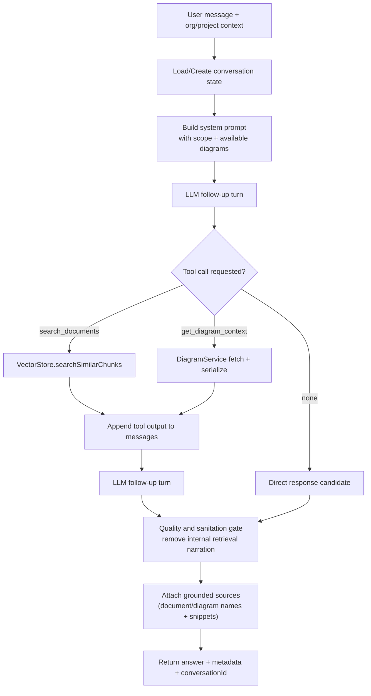
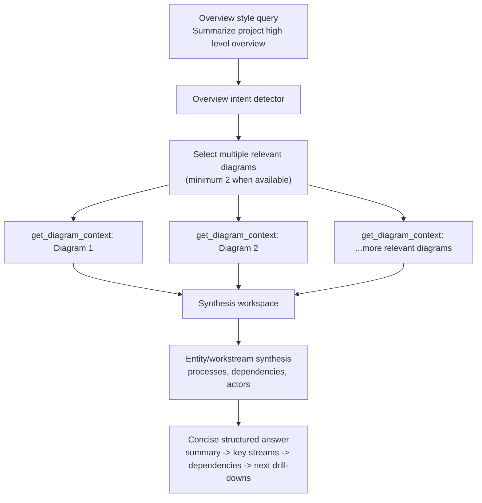
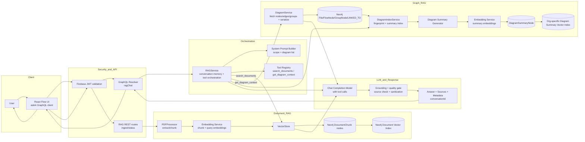

# Chatbot Architecture Diagrams (RAG + Graph-RAG + Agentic)

This document provides intuitive and implementation-aligned architecture diagrams for your chatbot stack.

Scope covered:
- Document RAG (PDF/Text retrieval + grounded answer generation)
- Graph-RAG (diagram/flow retrieval from Neo4j graph structures)
- Agentic behavior (tool routing, retries, fallback, quality gates)
- One major combined end-to-end architecture flow

---

## 1. High-Level System Context

Why this matters:
- `RAGService` is the central orchestrator that decides whether to query documents, diagrams, or both.
- Retrieval is split into two specialized knowledge channels:
  - Document semantics (`DocumentChunk` vector search)
  - Diagram process/relationship semantics (graph fetch + diagram summary vector search)

---

## 2. Document Ingestion and Indexing Flow (RAG)

What this flow explains:
- Ingestion is secure and scoped by organization/project relationships.
- The system avoids unnecessary recomputation unless forced.
- Final searchable units are text chunks with embeddings in Neo4j.

---

## 3. Diagram Indexing Flow (Graph-RAG Preparation)

What this flow explains:
- Graph-RAG does not just store raw graph data; it creates a semantic summary layer for fast retrieval.
- Fingerprinting prevents expensive re-indexing for non-meaningful visual changes.

---

## 4. Query-Time Agentic Orchestration Flow

Agentic features present in your implementation:
- Dynamic tool selection (`search_documents`, `get_diagram_context`).
- Multi-turn tool loop before final answer generation.
- Output sanitation to remove internal retrieval chatter.
- Source-aware final response packaging.

---

## 5. Broad Overview / Multi-Diagram Synthesis Flow
It is for handling overview-style queries (e.g., “Give me a high-level summary of the project”). It forces the agent to pull multiple diagrams before answering, then synthesize across them instead of relying on a single artifact.

Why this is important:
- Prevents shallow single-artifact summaries.
- Encourages cross-diagram evidence aggregation for better project-level explanations.

---

## 6. Major Combined End-to-End Architecture (Master Diagram)

Reading this master diagram:
- Left to right shows the real runtime path from user to final answer.
- Top-level split:
  - API/security entry
  - Orchestrator/agent loop
  - Document RAG subsystem
  - Graph-RAG subsystem
  - Final LLM synthesis and response governance
- Graph-RAG includes both:
  - Live structural retrieval (`DiagramService`)
  - Semantic retrieval accelerator (`DiagramIndexService` + summary embeddings)

---
